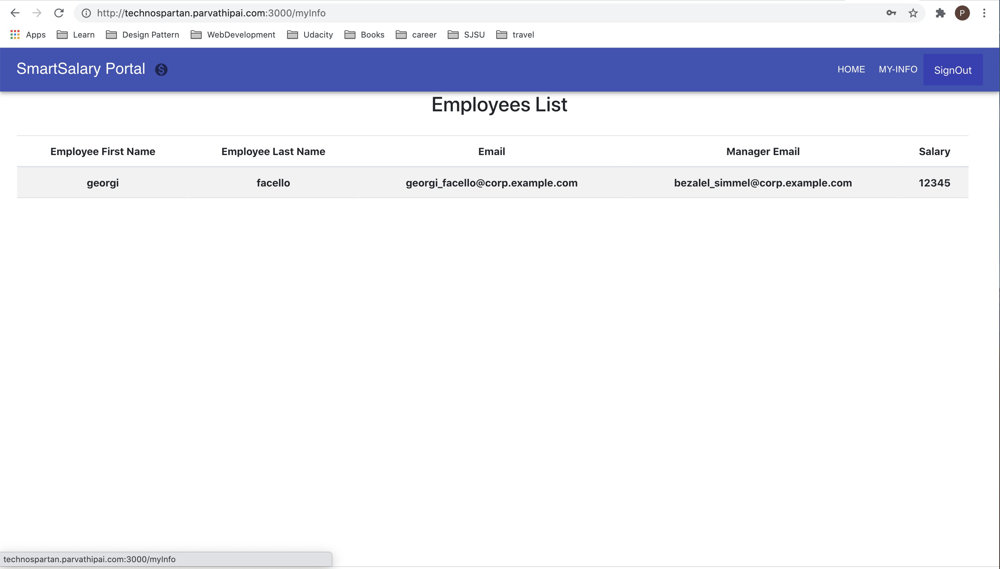
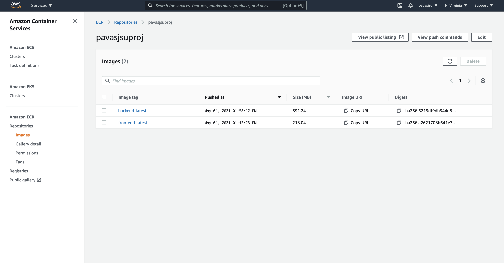

# Cloud Services Project

## University : [San Jose State University](http://www.sjsu.edu/)
## Course: CMPE 282 - Cloud Services
## Professor: Andrew Bond

## Team :
Student Name      | 
-------------     |
Parvathi Pai      |
Shreya Ghotankar  |
Sania Gonsalves   |

### Introduction
We have used the default project database and created application called Smart Salary where the employees can view their information like salary and reporting manager on a dashboard. Managers can see employees reporting to them. HR can see the list of all employees and  HR department specific dashboard that provides insights into each employee’s growth over the years.
This project majorly focus on data analysis and data visualization to generate salary insights. We have used Amazon Elastic Container Service for our application deployment.

 3 roles: Employee, Manager and HR.
Our application has following features –
* Employee Dashboard – Employee information like name, salary, reporting manager
* Manager Dashboard – Own Information, List of employees reporting to her/him.
* HR Dashboard- List of all Employees, perform actions like update, delete and add employees, HR department specific dashboard to view Employee Trends – insights into employee demographics based on gender, age and salary difference by age.

#### [Project Report](Documentation/CMPE282-Project_Report.pdf)

### Architecture

### Application UI screenshots
* Landing Page

* Employee



* Manager


* HR


### Technology and services Stack
* Okta - Single Page Application
* Database -
    * AWS RDS - MYSQL
* Data Insights - Databricks, Python, Pandas, Matplotlib
* Deployment
    * Docker
    * Docker Compose
    * Amazon Container Service
    * Amazon Container Registry
    * AWS Fargate


#### Deployment
* ECR

* ECS Cluster


* Services


### CI/CD
 1. We have 3 environments created for CI/CD as shown in the figure
   

 2. The ecslocal environment is for local ECS CI/CD setup
 3. myecscontext is for registering our service to ECR then to ECS.
 4. The context switch could be done as shown in the figure
     
 5. Docker push pusehes the images to ECR and ECS as shown in the figure
     
    
   


#### For Front-end setup
##### Install Dependencies
`npm install`

##### Environment variable setup
Create a '.env.local' file in your project root directory.
Add following variables -
```
REACT_APP_OKTA_CLIENT_ID={yourClientId}
REACT_APP_OKTA_ORG_URL=https://{yourOktaDomain}
REACT_APP_OKTA_API_TOKEN={yourToken}
```

Use these varaibles in SecuredApp.js

#### For Back-end setup
* Update application.properties with Database information
```
spring.datasource.driver-class-name=com.mysql.jdbc.Driver
spring.datasource.url=jdbc:mysql://${MYSQL_HOST}:3306/${MYSQL_DBNAME}?serverTimezone=UTC
spring.datasource.username=${MYSQL_USERNAME}
spring.datasource.password=${MYSQL_PASSWORD}
spring.jpa.database-platform = org.hibernate.dialect.MySQL5Dialect
spring.jpa.generate-ddl=true
spring.jpa.hibernate.ddl-auto = update
```
#### Run application
* For Frontend
    `npm start`
    * URI: http://localhost:3000
* For Backend
    * run the BackendApplication - http://localhost:8080
